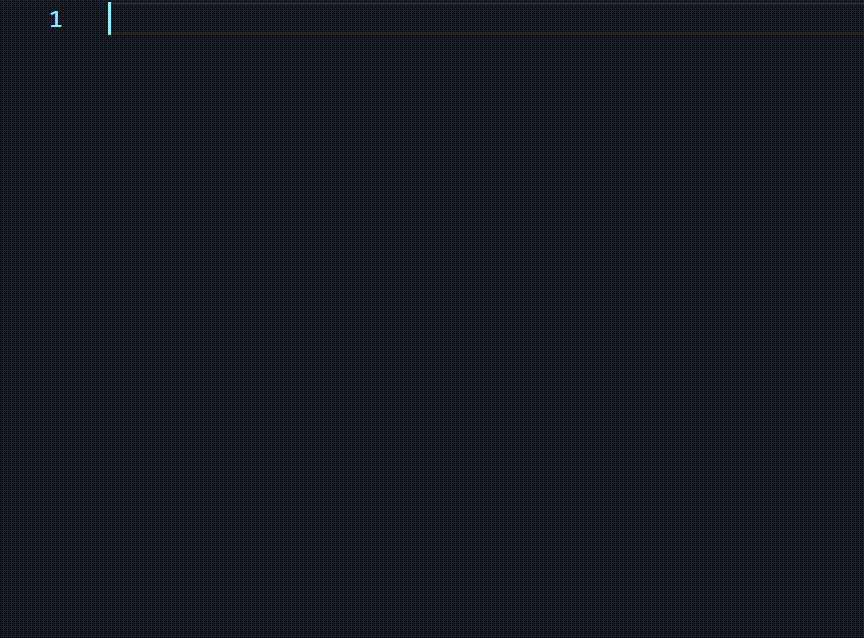

# WebX - Syntax and Snippets
This extension adds basic syntax highlighting and essential snippets for WebX files.
> WebX is a simple declarative language for creating RESTful web services and dynamic application backends.
Read more about WebX at [https://github.com/webx-net/webx](https://github.com/webx-net/webx).

## Features
This extension includes the following features:
* Syntax highlighting for WebX files
    * Emedded TypeScript and TSX
* Snippets for WebX files

## Syntax Highlighting
Support for syntax highlighting of all WebX files. This language is a superset of `typescriptreact`.

Currently, the syntax highlighting grammar is limited to one route declaration per line. This is due to the fact that the grammar is running using TextMate, which does not support multiline rules.

## Snippets
The following snippets are available for WebX files:
- `global` - Global TypeScript declarations
- `model` - Model definitions
- `handler` - Handler definitions
- `location` - Location scopes
- `get`/`post`/`etc.` - Route declaration

## Release Notes
### 0.0.1
Initial release of the WebX syntax highlighting and snippets extension for Visual Studio Code. This extension is still in development and may contain bugs. Please report any issues to the [GitHub repository](https://github.com/webx-net/webx-extension/issues).

**Enjoy!**